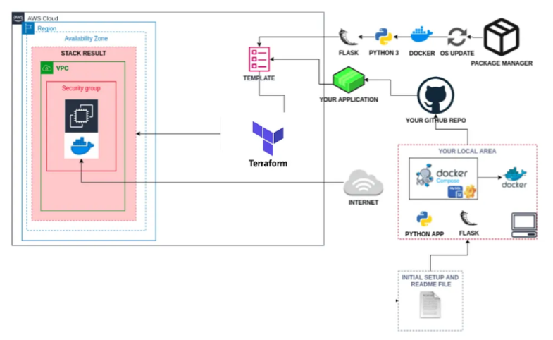

# kpmg-interview# Demo app deployment



Demo Python web app creation, dockerization and deployment on AWS. Using terraform for AWS resources creation and Nginx (installed and configured on EC2, as part of terraform) for High availability and  Load balancing.


#  The app

Demo Python web app created using

  - flask module
  - flask serves a simple index.html
  - Updated for Python3

### Docker Image
For simplicity, compatibility and maintainability, we can dockerize the app.

 - Lightweight - Built directly from python:3.9-slim 
 - Tried and tested on ARM64 platforms
  - Create docker image by running below command
```sh
$ cd sampleapp
$ docker build -t demoapp .
```
  - App is managed and run  as non-root user inside the docker
  - One can skip this step if required and use already Created and pushed image from dockerhub (Image name: yogeshvk1209/pywebapp2025). Image has port exposed on 8080

#  The Deployment

Terraform docker setup.
  - Terraform docker setup Auto-Scaling groups with launch template and ALB frontend
  - AMI being used is Alinux2023 ARM64.
  - Outputs ALB Public DNS name
  - To access webapp, use URL http://<ALB_Public_dns>
  - Docker nodes can run multiple dockers at different port and nginx can be made to point them.
  - Working with provider.aws = 5.90.0 and Terraform = 1.12.xx

To run as is, run below commands

```sh
$ cd terraform
$ terraform init
$ terraform plan
$ terraform apply
```


**Flask Application Deployment on AWS with Docker, ALB, and CI/CD**

---

### 🔄 Project Summary

A production-ready Flask web application was containerized using Docker and deployed on AWS EC2. An Application Load Balancer (ALB) distributes traffic to the containerized app running on EC2. The entire infrastructure is provisioned via Terraform, with additional recommendations to improve production readiness.

---

### 🌐 Application Architecture

* **Flask App** with `/` and `/health` endpoints
* **Dockerized** app for consistent deployment
* **Exposed on port 8081**
* **Health checks** via `/health` endpoint for ALB integration

---

### ⚙️ Infrastructure Overview

* **EC2 Instance** to run Docker container
* **Application Load Balancer (ALB)**
* **Target Group** configured to forward traffic to EC2 on port 8081
* **Security Group Rules**:

  * Port 80: Public access (HTTP)
  * Port 8081: Internal access (for ALB)
  * Port 22: SSH (restricted to known IPs)

---

### 🌎 AWS Architecture Diagram (simplified)

```
[ User ]
   |
[ Route 53 (DNS) ]
   |
[ HTTPS via ACM (optional) ]
   |
[ ALB (port 80/443) ]
   |
[ Target Group (port 8081) ]
   |
[ EC2 instance (Docker container running Flask)]
```

---

### 🚀 CI/CD Pipeline (GitHub Actions)

* **Build & Push Docker Image** to Docker Hub
* **Terraform Apply** to deploy infrastructure
* **SSH** into EC2 to pull latest image & run container

---

### 🔒 Security Best Practices

* Use **IAM roles** for EC2 with **least privileges**
* Restrict **SSH access (port 22)** to **trusted IP addresses**
* Use **HTTPS via ACM certificates**

---

### 🌟 Advanced Enhancements (for Production)

* Migrate from EC2 to **ECS Fargate** for serverless container orchestration
* Setup **RDS (PostgreSQL/MySQL)** or **DynamoDB** as backend database
* Use **CloudWatch** for real-time monitoring and logging
* **Route 53 + ACM** for secure DNS and HTTPS
* Automate everything with **CI/CD pipeline**

---

### 📊 Monitoring and Observability

* **CloudWatch Logs** to monitor app & container health
* **ALB Metrics** to track traffic & response codes
* Optionally set up **alarms** for CPU, memory, or error rate thresholds

---

### 🏆 Interview Talking Points

| Topic         | Key Takeaways                                      |
| ------------- | -------------------------------------------------- |
| Docker        | Portable, isolated application environment         |
| Flask         | Lightweight, Python-based microframework           |
| ALB           | Intelligent traffic distribution and health checks |
| Terraform     | Declarative IaC for repeatable infra deployments   |
| CI/CD         | Automation of build, deploy, and release           |
| Security      | IAM, SG, HTTPS are key layers of defense           |
| Observability | Metrics + logs = reliable production operations    |

---

### 🚧 Next Steps (If Building Further)

* Container image scanning for vulnerabilities
* Centralized log aggregation (e.g., with ELK or CloudWatch Insights)
* Enable autoscaling with ECS or EC2 ASG
* Deployment strategy enhancements (e.g., Blue/Green)

---

This architecture is designed to be extensible, secure, observable, and aligned with best practices for deploying Python-based web applications on AWS.
